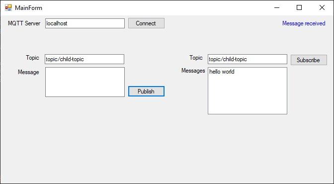

# PoC MQTT Messaging App

This is a simple proof of concept for a messaging app using MQTT and Windows Forms.

## Overview

The app is a simple Windows Forms application that allows users to send and receive messages using MQTT. The app uses the [MQTTnet](https://github.com/dotnet/MQTTnet) library to connect to an MQTT broker and send/receive messages.



## Additional

### MQTT Server/Broker

A [Docker Compose file](mqtt-server\docker-compose.yml) is included in the repository that sets up an MQTT server using [Eclipse Mosquitto](https://mosquitto.org/). To start the server, run the following command:

```bash
cd mqtt-server
docker-compose up -d
```

## References

- [MQTTnet](https://github.com/dotnet/MQTTnet)
- [Docker Hub: Eclipse Mosquitto](https://hub.docker.com/_/eclipse-mosquitto/)
